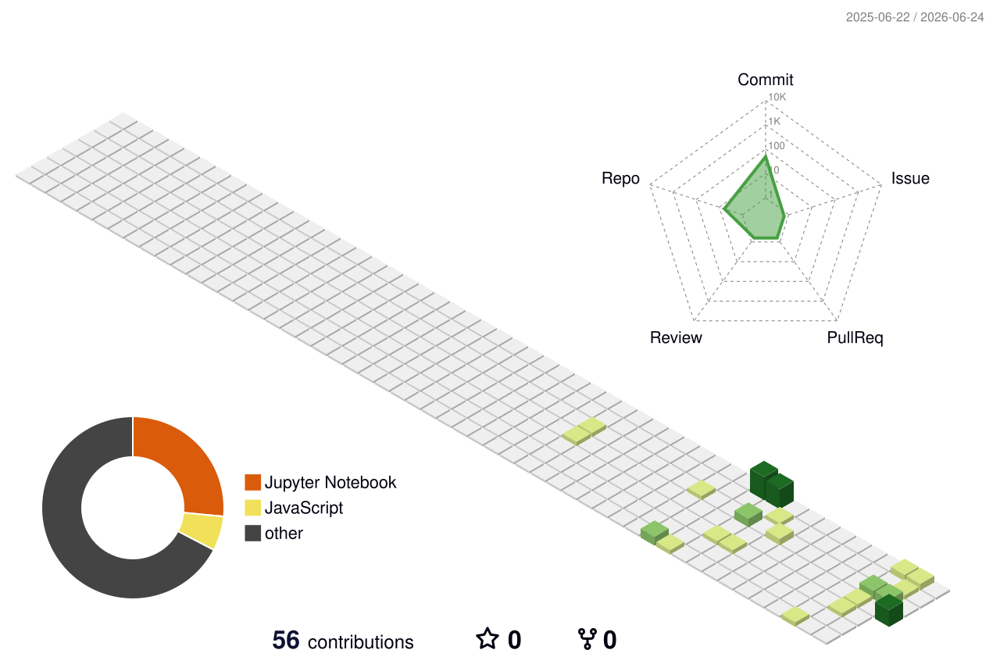

<div align="center">


[](https://git.io/typing-svg)

</div>

---

<div align="center">


</div>

<table align="center" width="100%">
<tr>
<td align="center" width="50%">


**ABHINAV ROY**

</td>
<td align="center" width="50%">


**B.TECH CSE (DATA SCIENCE)**

</td>
</tr>
<tr>
<td align="center">


**SOPHOMORE**

</td>
<td align="center">


**DEEPSEEK-R1 14B ON RTX 4060**

</td>
</tr>
<tr>
<td align="center" colspan="2">


**MACHINE LEARNING &#8226; AI SYSTEMS &#8226; BACKEND ENGINEERING**

</td>
</tr>
<tr>
<td align="center" colspan="2">


**BUILDING ML & AI PROJECTS FROM SCRATCH — INCLUDING A GAME-BASED CAPTCHA SYSTEM (DINO RUN-STYLE) WITH HMAC SESSION SECURITY, PASSIVE BEHAVIOR TRACKING, AND AN ML BRIDGE INTEGRATION USING FASTAPI AND REDIS.**

</td>
</tr>
<tr>
<td align="center" colspan="2">


**AI/ML PROJECTS, SYSTEM DESIGN EXPERIMENTS, AND OPEN-SOURCE TOOLS AROUND AUTOMATION AND INTELLIGENT SYSTEMS.**

</td>
</tr>
<tr>
<td align="center" colspan="2">


**FINE-TUNING LLMS ON LOW VRAM SETUPS AND SCALING ML PIPELINES EFFICIENTLY.**

</td>
</tr>
<tr>
<td align="center" colspan="2">


**MACHINE LEARNING, AI CONCEPTS, MYSQL, SYSTEM DESIGN, AND BUILDING PRODUCTION-READY DEV ENVIRONMENTS.**

</td>
</tr>
<tr>
<td align="center" colspan="2">


**LOCAL AI STACKS WITH OLLAMA, N8N AUTOMATION WORKFLOWS, FASTAPI BACKENDS, AND SETTING UP A FULL DEV ENVIRONMENT ON WINDOWS FROM SCRATCH.**

</td>
</tr>
<tr>
<td align="center" colspan="2">


**I RUN A 14B PARAMETER LLM LOCALLY ON MY RTX 4060 WHILE ALSO USING THE SAME MACHINE FOR GAMING.**

</td>
</tr>
</table>


---

<h2 align="center">🌐 SOCIALS</h2>

<div align="center">

[](https://instagram.com/_abhinav_roy001)
[](https://www.linkedin.com/in/abhinav-roy-/)
[](https://x.com/@roy_abhinav_)
[](mailto:abhinav.roy.10.07.05@gmail.com)

</div>

---

<h2 align="center">💻 TECH STACK</h2>

<div align="center">

**LANGUAGES**


**ML / AI / DATA SCIENCE**


**BACKEND & AUTOMATION**


**DATABASES**


**CLOUD & DEVOPS**


**TOOLS & OTHERS**


</div>

---

<h2 align="center">📊 GITHUB STATS</h2>

<div align="center">


</div>

---

<h2 align="center">🧊 3D CONTRIBUTION GRAPH</h2>

<div align="center">

<picture>
  <source media="(prefers-color-scheme: dark)" srcset="https://raw.githubusercontent.com/Abhinav-Roy-01/Abhinav-Roy-01/output-3d-contrib/profile-night-green.svg" />
  <source media="(prefers-color-scheme: light)" srcset="https://raw.githubusercontent.com/Abhinav-Roy-01/Abhinav-Roy-01/output-3d-contrib/profile-green.svg" />
  
</picture>

</div>


---

<h2 align="center">🐍 CONTRIBUTION SNAKE</h2>

<div align="center">

<picture>
  <source media="(prefers-color-scheme: dark)" srcset="./profile-3d-contrib/profile-night-green.svg" />
  <source media="(prefers-color-scheme: light)" srcset="./profile-3d-contrib/profile-green-animate.svg" />
  
</picture>

</div>

> **SETUP:** ADD THIS WORKFLOW AT `.github/workflows/snake.yml` IN YOUR PROFILE REPO:
>
> ```yaml
> name: Generate Snake
> on:
>   schedule: [{ cron: "0 0 * * *" }]
>   workflow_dispatch:
> jobs:
>   generate:
>     runs-on: ubuntu-latest
>     steps:
>       - uses: Platane/snk@v3
>         with:
>           github_user_name: Abhinav-Roy-01
>           outputs: |
>             dist/github-snake.svg
>             dist/github-snake-dark.svg?palette=github-dark
>       - uses: crazy-max/ghaction-github-pages@v3
>         with:
>           target_branch: output
>           build_dir: dist
>         env:
>           GITHUB_TOKEN: ${{ secrets.GITHUB_TOKEN }}
> ```

---

<h2 align="center">🏆 LEETCODE STATS</h2>

<div align="center">

[](https://leetcode.com/ABHINAV_ROY_)

</div>

---

<h2 align="center">🏆 GITHUB TROPHIES</h2>

<div align="center">


</div>

---

<h2 align="center">✍️ RANDOM DEV QUOTE</h2>

<div align="center">


</div>

---

<h2 align="center">🔝 TOP CONTRIBUTED REPOS</h2>

<div align="center">


</div>

> **NOTE:** THERE ISN'T CURRENTLY A MAINTAINED "3D" VERSION OF THIS SPECIFIC WIDGET — I DIDN'T WANT TO POINT YOU AT A FAKE/BROKEN URL. THIS FLAT CARD ABOVE IS STILL THE MOST RELIABLE ONE FOR TOP CONTRIBUTED REPOS. IF YOU STILL WANT A 3D/ISOMETRIC FEEL SOMEWHERE ON THE PROFILE, THE CONTRIBUTION GRAPH SECTION ABOVE ALREADY COVERS THAT.

---

<div align="center">

[](https://visitcount.itsvg.in)


</div>

<!-- PROUDLY CRAFTED BY ABHINAV ROY -->
